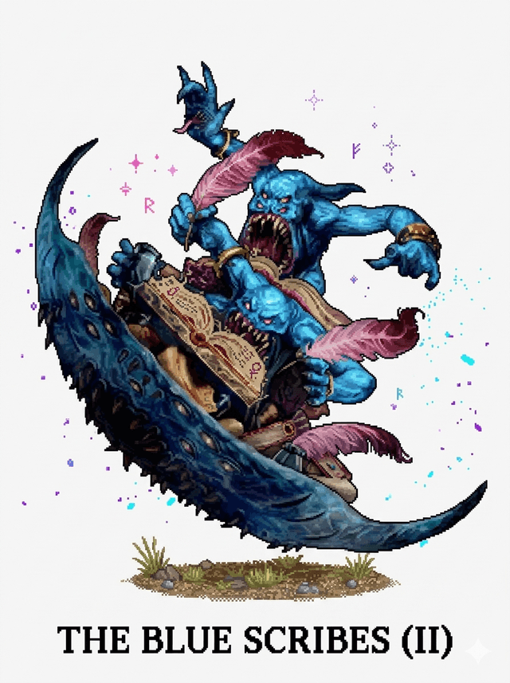

# The Blue Scribes — a TOW rules chatbot

> *In the lore, the Blue Scribes are two Tzeentchian heralds — **Xirat'p**, who reads
> every request, and **P'tarix**, who writes the answer — forever travelling the world
> collecting spells and scraps of arcane knowledge.*

<p align="center"></p>

A single-file web chatbot that answers **Warhammer: The Old World** rules questions.
No build, no backend — just a static page you can host on GitHub Pages or open locally.

👉 **Live app:** https://morgensternprinting.github.io/TheBlueScribes/ *(enable Pages on the branch)*

## What it does

- **Answers rules questions** about *The Old World* — special rules, magic items, magic
  lores and their interactions — grounded in a knowledge base of **371 special rules,
  653 magic items and 17 army lores** extracted from the [TOW en 1](https://github.com/morgensternprinting/TOWen1) companion app.
- **Asks for clarification when in doubt.** If a question is ambiguous, the Scribes ask a
  short follow-up before answering rather than guessing.
- **Collects what it doesn't know (the Sandbox / *bac à sable*).** When a question is
  outside its archives, the bot *congratulates* the player, says it doesn't have the
  ruling, and asks the player for the answer. That question + answer is then kept in a
  local **sandbox** (🧪) for later evaluation, and can be exported as JSON.
- **Bilingual FR/EN.** The interface toggles between French and English, and the bot
  always replies in the language of your question.
- **Two-scribe presentation.** While interpreting your message the UI shows
  *“Xirat'p lit votre demande”*; the streamed answer is attributed to **P'tarix**.

## How it works

The page calls the **Anthropic API directly from your browser** using **your own API key**
(model: `claude-opus-4-8`). The key is stored only in your browser's `localStorage` and is
sent only to `api.anthropic.com` — there is no server in between.

- Get an API key at [console.anthropic.com](https://console.anthropic.com/settings/keys),
  then paste it under **⚙️ Settings**.
- Each conversation uses your own Anthropic credit.

The full rules knowledge base is sent as cached context on every request. That is
deliberate: seeing the *entire* ruleset is what lets the bot reliably tell when something
is genuinely **absent** — the trigger for the sandbox flow.

## Test the app

It's a static page — no build step.

**Locally (fastest):**
- Just open `index.html` in a modern browser, **or**
- Serve the folder (avoids any `file://` quirks):
  ```sh
  python3 -m http.server 8000   # then open http://localhost:8000
  ```
Then click **⚙️** and paste an [Anthropic API key](https://console.anthropic.com/settings/keys).

**Online via GitHub Pages (live URL to share/test):**
- Push to `main` (or run the **Deploy to GitHub Pages** workflow manually on any
  branch from the **Actions** tab), then enable
  `Settings → Pages → Source = GitHub Actions`. The app is served at
  https://morgensternprinting.github.io/TheBlueScribes/.
- Classic alternative: `Settings → Pages → Deploy from a branch → <branch> / root`.

## Releasing

Releases are produced by `.github/workflows/release.yml`:

- **Tag a version** — `git tag v1.0.0 && git push origin v1.0.0`, **or** run the
  **Release** workflow from the Actions tab and enter a tag (e.g. `v1.0.0`).
- The workflow zips the app (`index.html`, `data/`, `build/`, `README.md`,
  `LICENSE`) into `the-blue-scribes-<tag>.zip` and publishes a **GitHub Release**
  with that asset plus auto-generated notes.
- Testers can download the zip, unzip it, and open `index.html` — no install.

## Regenerating the rules data

`data/rules-data.js` is generated from the TOWen1 app's `index.html`:

```sh
node build/extract.js ../TOWen1/index.html
# or, if TOWen1 sits next to this repo, just:
node build/extract.js
```

It brace-matches and evaluates the `RULES_DB`, `MAGIC_ITEMS_DB` and `ARMY_LORES`
objects and writes `window.TOW_RULES = {…}`.

## Files

| Path | What |
|------|------|
| `index.html` | The whole app — UI, chat loop, streaming, tool use, sandbox. |
| `data/rules-data.js` | Generated knowledge base (`window.TOW_RULES`). |
| `build/extract.js` | Rebuilds the knowledge base from TOWen1. |
| `.github/workflows/deploy-pages.yml` | Deploys the app to GitHub Pages. |
| `.github/workflows/release.yml` | Builds the zip and publishes a GitHub Release. |
| `LICENSE` | MIT (original code/tooling only — not the GW rules content). |

## ⚠️ Disclaimer

Unofficial, fan-made tool — **not** endorsed by, affiliated with, or approved by Games
Workshop Limited. *Warhammer: The Old World*, all associated names, rules and imagery are
the intellectual property of **Games Workshop Ltd.** Shared for personal, non-commercial
use only. **AI answers can be wrong — the official rulebook and FAQs are authoritative.**
